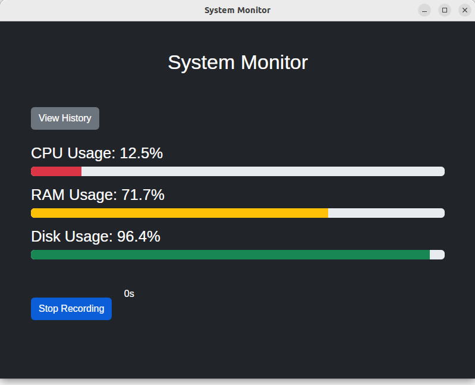
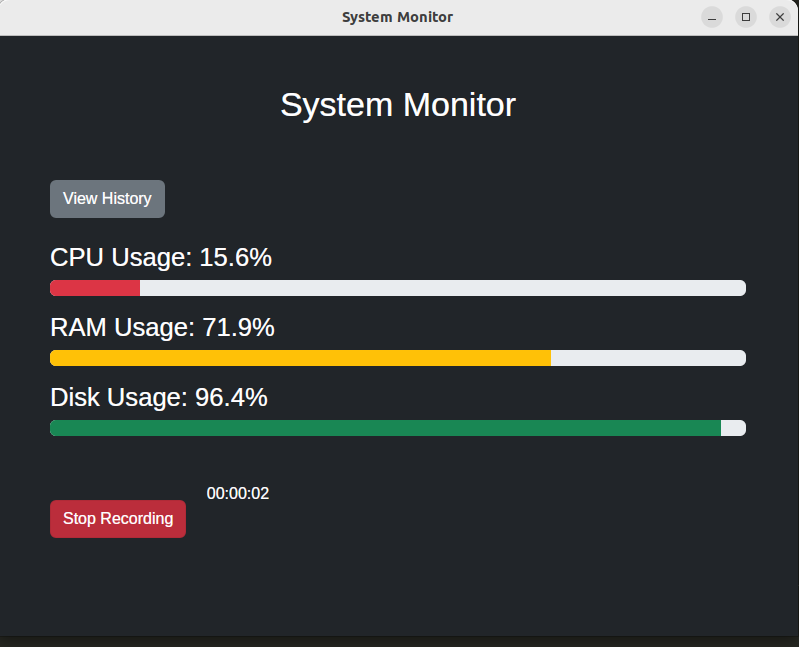

# System Info Monitor Desktop App

## Этот проект представляет собой настольное приложение для мониторинга использования CPU, RAM и диска в режиме реального времени с возможностью сохранения данных в базу данных SQLite.

## 📄 Установка и запуск

## 1. Клонирование репозитория

Склонируйте репозиторий и перейдите в папку проекта:

git clone https://github.com/yourusername/system-info-monitor.git
cd system-info-monitor

## 2. Создание виртуального окружения и установка зависимостей

Создайте виртуальное окружение и установите необходимые зависимости:

```python -m venv venv
   source venv/bin/activate  # Для Windows: venv\Scripts\activate
   pip install -r requirements.txt
   ```

## 3 Запуск приложения

Для запуска приложения выполните следующую команду:

`python main.py`

Или просто запустите файл system_info_app

# Скриншоты 





